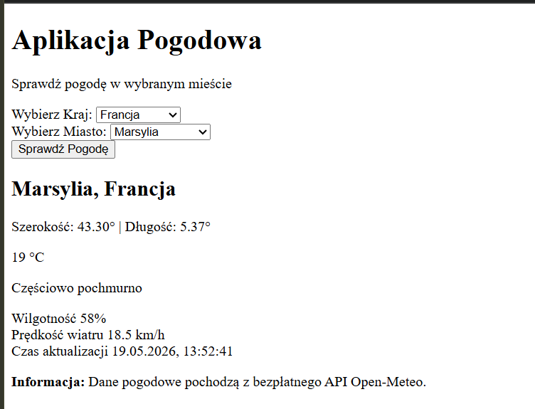
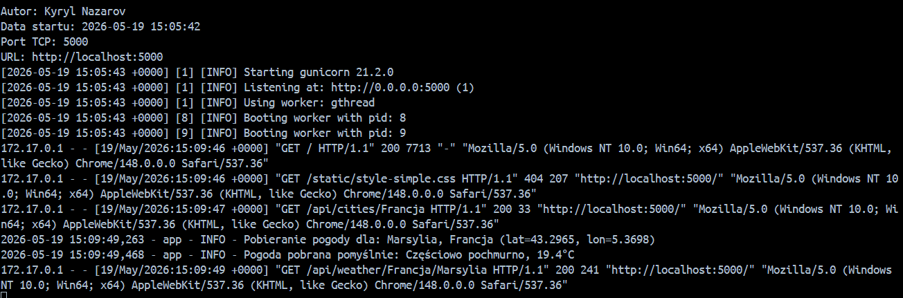
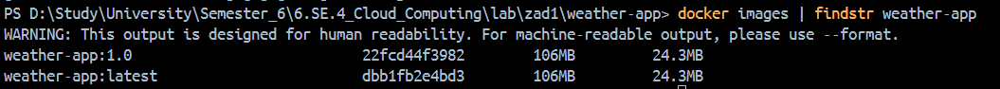

Cel zadania: Stworzenie aplikacji pogodowej w Dockerze, która pozwala
na wybór kraju i miasta oraz wyświetla aktualną pogodę.

Autor: Kyryl Nazarov
Data wykonania: 2026-05-19

Aplikacja została napisana w Flask (Python web framework) i realizuje
następującą funkcjonalność:

- Interfejs webowy do wyboru kraju i miasta
- Pobieranie aktualnej pogody z Open-Meteo API
- Wyświetlanie: temperatury, wilgotności, prędkości wiatru
- Dynamiczne ładowanie miast na podstawie wybranego kraju

---

1. Kod Aplikacji (app.py)

---

"""
Aplikacja pogodowa - Flask
Autor: Kyryl Nazarov

Aplikacja pozwala na wybór kraju i miasta, wyświetlając aktualną pogodę
na podstawie Open-Meteo API
"""

from flask import Flask, render_template, request, jsonify
import requests
from datetime import datetime
import logging
import os
import sys

# ----- Konfiguracja -----

# Inicjalizacja Flask

app = Flask(**name**)

# Konfiguracja loggowania

logging.basicConfig(
level=logging.INFO, format="%(asctime)s - %(name)s - %(levelname)s - %(message)s"
)
logger = logging.getLogger(**name**)

# Port aplikacji

PORT = os.getenv("PORT", 5000)
AUTHOR = "Kyryl Nazarov"

# Predefiniowana lista miast

CITIES_DATA = {
"Polska": {
"Warszawa": {"lat": 52.2297, "lon": 21.0122},
"Kraków": {"lat": 50.0647, "lon": 19.9450},
"Wrocław": {"lat": 51.1079, "lon": 17.0385},
"Poznań": {"lat": 52.4082, "lon": 16.9454},
"Gdańsk": {"lat": 54.3520, "lon": 18.6466},
},
"Niemcy": {
"Berlin": {"lat": 52.5200, "lon": 13.4050},
"Monachium": {"lat": 48.1351, "lon": 11.5820},
"Hamburg": {"lat": 53.5511, "lon": 9.9937},
"Kolonia": {"lat": 50.9375, "lon": 6.9603},
},
"Francja": {
"Paryż": {"lat": 48.8566, "lon": 2.3522},
"Lyon": {"lat": 45.7640, "lon": 4.8357},
"Marsylia": {"lat": 43.2965, "lon": 5.3698},
},
"Włochy": {
"Rzym": {"lat": 41.9028, "lon": 12.4964},
"Mediolan": {"lat": 45.4642, "lon": 9.1900},
"Wenecja": {"lat": 45.4408, "lon": 12.3155},
},
"Anglia": {
"Londyn": {"lat": 51.5074, "lon": -0.1278},
"Manchester": {"lat": 53.4808, "lon": -2.2426},
"Liverpool": {"lat": 53.4084, "lon": -2.9916},
},
"Portugalia": {
"Lizbona": {"lat": 38.7223, "lon": -9.1393},
"Porto": {"lat": 41.1579, "lon": -8.6291},
"Faro": {"lat": 37.0141, "lon": -7.9365},
"Braga": {"lat": 41.5454, "lon": -8.4265},
},
"Ukraina": {
"Kijów": {"lat": 50.4501, "lon": 30.5234},
"Charków": {"lat": 50.0028, "lon": 36.2304},
"Lwów": {"lat": 49.8397, "lon": 24.0297},
"Odessa": {"lat": 46.4856, "lon": 30.7326},
"Dnipro": {"lat": 48.4647, "lon": 35.0467},
},
}

def log_startup():
print(f"Autor: {AUTHOR}", flush=True)
print(f"Data startu: {datetime.now().strftime('%Y-%m-%d %H:%M:%S')}", flush=True)
print(f"Port TCP: {PORT}", flush=True)
print(f"URL: http://localhost:{PORT}", flush=True)
sys.stdout.flush()

# ----- Routes -----

# Strona główna

@app.route("/")
def index():
return render_template("index.html", countries=list(CITIES_DATA.keys()))

# Zwracanie miast dla kraju

@app.route("/api/cities/<country>")
def get_cities(country):
if country in CITIES_DATA:
return jsonify(list(CITIES_DATA[country].keys()))
return jsonify([]), 404

# Pobieranie pogody dla wybranego miasta

@app.route("/api/weather/<country>/<city>")
def get_weather(country, city):
try:
if country not in CITIES_DATA:
return jsonify({"error": "Kraj nie znaleziony"}), 404

        if city not in CITIES_DATA[country]:
            return jsonify({"error": "Miasto nie znalezione"}), 404

        coords = CITIES_DATA[country][city]
        lat, lon = coords["lat"], coords["lon"]

        url = "https://api.open-meteo.com/v1/forecast"
        params = {
            "latitude": lat,
            "longitude": lon,
            "current": "temperature_2m,relative_humidity_2m,weather_code,wind_speed_10m",
            "temperature_unit": "celsius",
            "wind_speed_unit": "kmh",
            "timezone": "auto",
        }

        logger.info(f"Pobieranie pogody dla: {city}, {country} (lat={lat}, lon={lon})")

        response = requests.get(url, params=params, timeout=5)
        response.raise_for_status()

        data = response.json()
        current = data.get("current", {})

        weather_codes = {
            0: "Czysty błękit",
            1: "Przede wszystkim pogodnie",
            2: "Częściowo pochmurno",
            3: "Pochmurno",
            45: "Mgła",
            48: "Mgła zapamiętana",
            51: "Drażniła mżawka",
            53: "Umiarkowana mżawka",
            55: "Gęsta mżawka",
            61: "Słaby deszcz",
            63: "Umiarkowany deszcz",
            65: "Intensywny deszcz",
            71: "Słaby śnieg",
            73: "Umiarkowany śnieg",
            75: "Intensywny śnieg",
            80: "Przelotne opady",
            81: "Umiarkowane przelotne opady",
            82: "Intensywne przelotne opady",
            85: "Lekkie przelotne opady śniegu",
            86: "Silne przelotne opady śniegu",
            95: "Burza",
            96: "Burza ze słabym gradem",
            99: "Burza z intensywnym gradem",
        }

        weather_code = current.get("weather_code", 0)
        weather_description = weather_codes.get(weather_code, "Brak danych")

        weather_data = {
            "city": city,
            "country": country,
            "latitude": lat,
            "longitude": lon,
            "temperature": current.get("temperature_2m", "N/A"),
            "humidity": current.get("relative_humidity_2m", "N/A"),
            "wind_speed": current.get("wind_speed_10m", "N/A"),
            "weather_code": weather_code,
            "weather_description": weather_description,
            "timestamp": datetime.now().isoformat(),
        }

        logger.info(
            f"Pogoda pobrana pomyślnie: {weather_description}, {current.get('temperature_2m')}°C"
        )
        return jsonify(weather_data)

    except requests.exceptions.RequestException as e:
        logger.error(f"Błąd połączenia z API pogody: {str(e)}")
        return jsonify({"error": f"Błąd pobierania danych pogody: {str(e)}"}), 500
    except Exception as e:
        logger.error(f"Nieoczekiwany błąd: {str(e)}")
        return jsonify({"error": "Błąd serwera"}), 500

@app.route("/health")
def health_check():
return jsonify({"status": "healthy", "timestamp": datetime.now().isoformat()}), 200

# ----- Uruchomienie -----

if **name** == "**main**":
log_startup()
app.run(host="0.0.0.0", port=int(PORT), debug=False)

---

2. Interfejs HTML (templates/index.html)

---

<!DOCTYPE html>
<html lang="pl">

<head>
    <meta charset="UTF-8">
    <meta name="viewport" content="width=device-width, initial-scale=1.0">
    <title>Aplikacja Pogodowa</title>
    <link rel="stylesheet" href="{{ url_for('static', filename='style-simple.css') }}">
</head>

<body>
    

        <!-- Header -->
        

            <h1>Aplikacja Pogodowa</h1>
            
Sprawdź pogodę w wybranym mieście

        

        <!-- Formularz -->
        

            

                <label for="country-select">Wybierz Kraj:</label>
                <select id="country-select">
                    <option value="">Wybierz kraj</option>
                    
                    <option value="{{ country }}">{{ country }}</option>
                    
                </select>
            

            

                <label for="city-select">Wybierz Miasto:</label>
                <select id="city-select" disabled>
                    <option value="">Najpierw wybierz kraj</option>
                </select>
            

            <button id="search-btn" onclick="getWeather()" disabled class="btn-primary">
                Sprawdź Pogodę
            </button>
        

        <!-- Error komunikat -->
        

        <!-- Wyniki -->
        

            

                <h2 id="location-name"></h2>
                

                

                    

                        --
                        °C
                    

                    

                        

                    

                

                

                    

                        Wilgotność
                        --
                    

                    

                        Prędkość wiatru
                        --
                    

                    

                        Czas aktualizacji
                        --
                    

                

            

        

        <!-- Info -->
        

            

                <strong>Informacja:</strong> Dane pogodowe pochodzą z bezpłatnego API Open-Meteo.
            

        

    

    <!-- Skrypty -->
    

</body>

</html>

---

3. Stylizacja znajduje się w pliku (static/style.css)

---

---

4. Dockerfile

---

Dockerfile wykorzystuje wieloetapowe budowanie
w celu optymalizacji rozmiaru obrazu.

# APLIKACJA POGODOWA

# Autor: Kyryl Nazarov

# Opis: Dockerfile do budowania kontenera aplikacji pogodowej z wykorzystaniem wieloetapowego budowania

# Przygotowanie zależności

FROM python:3.11-alpine AS builder

# Metadane OCI

LABEL org.opencontainers.image.authors="Kyryl Nazarov"
LABEL org.opencontainers.image.description="Weather application builder stage"
LABEL org.opencontainers.image.version="1.0.0"

# Ustawienie zmiennej środowiskowej

ENV PYTHONUNBUFFERED=1 \
 PYTHONDONTWRITEBYTECODE=1 \
 PIP_NO_CACHE_DIR=1

# Instalacja zależności systemowych wymaganych do budowania

RUN apk add --no-cache --virtual .build-deps \
 gcc \
 musl-dev \
 linux-headers

# Utworzenie katalogów

RUN mkdir -p /opt/venv
WORKDIR /app

# Instalacja Python'a w wirtualnym środowisku

RUN python -m venv /opt/venv
ENV PATH="/opt/venv/bin:$PATH"
RUN pip install --upgrade pip setuptools wheel && \
 pip install Flask==3.0.0 Werkzeug==3.0.1 requests==2.31.0 gunicorn==21.2.0

# Usunięcie zbędnych plików po instalacji

RUN find /opt/venv -type d -name "**pycache**" -exec rm -rf {} + 2>/dev/null || true && \
 find /opt/venv -type f -name "_.pyc" -delete && \
 find /opt/venv -type f -name "_.pyo" -delete

# Runtime

FROM python:3.11-alpine

# Informacja o autorze

LABEL org.opencontainers.image.authors="Kyryl Nazarov" \
 org.opencontainers.image.title="Weather Application" \
 org.opencontainers.image.description="Flask-based weather application with Open-Meteo API" \
 org.opencontainers.image.version="1.0.0" \
 org.opencontainers.image.source="https://github.com/nazkirill43-glitch/weather-app" \
 maintainer="Kyryl Nazarov"

# Zmienne środowiskowe dla aplikacji

ENV PYTHONUNBUFFERED=1 \
 PYTHONDONTWRITEBYTECODE=1 \
 PATH="/opt/venv/bin:$PATH" \
 PORT=5000 \
 FLASK_APP=app.py

# Instalacja tylko niezbędnych zależności

RUN apk add --no-cache \
 ca-certificates \
 tzdata

# Utworzenie użytkownika bez uprawnień root

RUN addgroup -g 1000 appuser && \
 adduser -D -u 1000 -G appuser appuser

# Ustawienie katalogu roboczego

WORKDIR /app

# Skopiowanie wirtualnego środowiska

COPY --from=builder --chown=appuser:appuser /opt/venv /opt/venv

# Skopiowanie kodu aplikacji

COPY --chown=appuser:appuser app.py .
COPY --chown=appuser:appuser templates/ ./templates/
COPY --chown=appuser:appuser static/ ./static/

# Zmiana na użytkownika non-root

USER appuser

# Exponowanie portu TCP

EXPOSE 5000

# Health check

HEALTHCHECK --interval=30s --timeout=5s --start-period=10s --retries=3 \
 CMD wget --no-verbose --tries=1 --spider http://localhost:5000/health || exit 1

CMD sh -c "echo 'Autor: Kyryl Nazarov' && \
 echo 'Data startu: $(date +%Y-%m-%d\ %H:%M:%S)' && \
 echo 'Port TCP: 5000' && \
 echo 'URL: http://localhost:5000' && \
 gunicorn \
 --bind 0.0.0.0:5000 \
 --workers 2 \
 --threads 2 \
 --worker-class gthread \
 --timeout 60 \
 --access-logfile - \
 --error-logfile - \
 app:app"

---

5. Statystyki obrazu

---

Rozmiar obrazu: 106 MB
Liczba warstw: ~25
Bazowy obraz: python:3.11-alpine

---

6. Budowanie obrazu
   docker build -t weather-app:latest .

---

---

7. Uruchomienie obrazu
   docker run --name weather-app --rm -p 5000:5000 weather-app:latest

---

---

8. Odczyt logów
   docker logs -f weather-app

---

---

9. Sprawdzenie rozmiaru
   docker images | findstr weather-app

---

---

10. Sprawdzanie liczby warstw
    docker history weather-app:latest

---

---

11. Zrzuty ekranowe

---

Działająca aplikacja

Logi

Docker images

