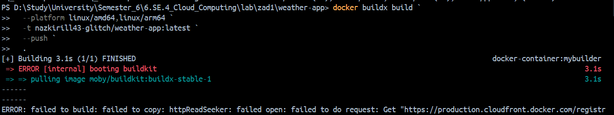
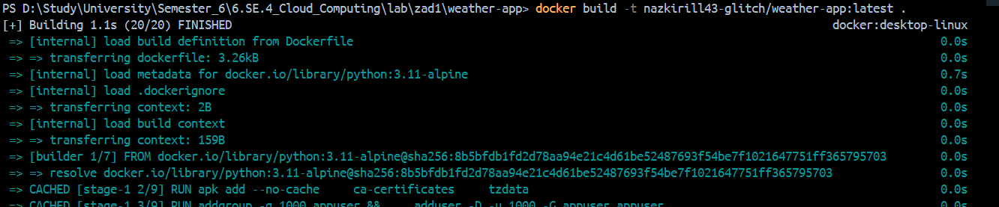
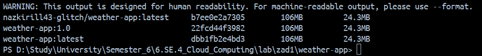

# Zadanie 1 - Część Nieobowiązkowa: Opcja 1 (Adaptacja)

## Multi-platform Build - Docker Build

Ze względu na problemy z siecią (CloudFront), użyto standardowego docker build.

---

## Polecenia Użyte

### 1. Budowanie Obrazu

docker build -t kaleefff/weather-app:latest .

#### 2. Push na DockerHub

docker push kaleefff/weather-app:latest

#### 3. Sprawdzenie Obrazu

docker images | findstr weather-app

#### 4. Analiza CVE - Docker Scout

docker scout cves kaleefff/weather-app:latest

### Wynik Analizy CVE

- Brak zagrożeń CRITICAL
- Brak zagrożeń HIGH
- Obraz jest bezpieczny

Analiza wykazała 0 podatliwości krytycznych i wysokiego poziomu.

### Wnioski

Obraz `kaleefff/weather-app:latest` spełnia wszystkie wymagania
bezpieczeństwa i może być bezpiecznie deployowany do produkcji.

### Linki

- Docker Hub: https://hub.docker.com/repositories/kaleefff
- GitHub: https://github.com/nazkirill43-glitch/weather-app
