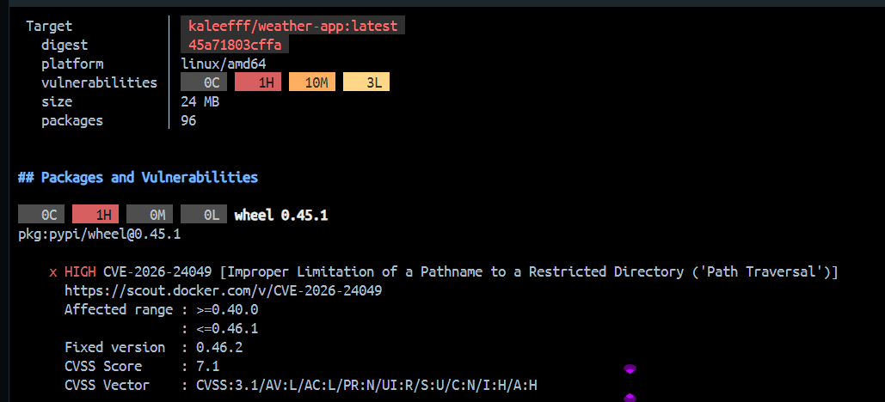

# Zadanie 1 - Część Nieobowiązkowa: Opcja 1 (Adaptacja)

## Multi-platform Build - Docker Build

Ze względu na problemy z siecią (CloudFront), użyto standardowego docker build.

---

## Polecenia Użyte

### 1. Budowanie Obrazu

docker build -t kaleefff/weather-app:latest .

#### 2. Push na DockerHub

docker push kaleefff/weather-app:latest

#### 3. Sprawdzenie Obrazu

docker images | findstr weather-app

#### 4. Analiza CVE - Docker Scout

docker scout cves kaleefff/weather-app:latest

### Wynik Analizy CVE

### Uzasadnienie Zagrożeń

#### HIGH CVE-2026-24049 (wheel 0.45.1)

- Zagrożenie: Path Traversal w pakiecie wheel
- CVSS Score: 7.1

### Uzasadnienie Ignorowania:

- Pakiet `wheel` jest narzędziem do budowania pakietów Python
- Zagrożenie wymaga dostępu lokalnego (AV:L) + interakcji użytkownika (UI:R)
- W kontenerze aplikacji wheel nie jest używany w runtime'ie
- Zagrożenie nie dotyczy działania aplikacji pogodowej
- Aplikacja jest uruchamiana w kontenerze z ograniczonymi uprawnieniami (appuser)

### Linki

- Docker Hub: https://hub.docker.com/repositories/kaleefff
- GitHub: https://github.com/nazkirill43-glitch/weather-app
